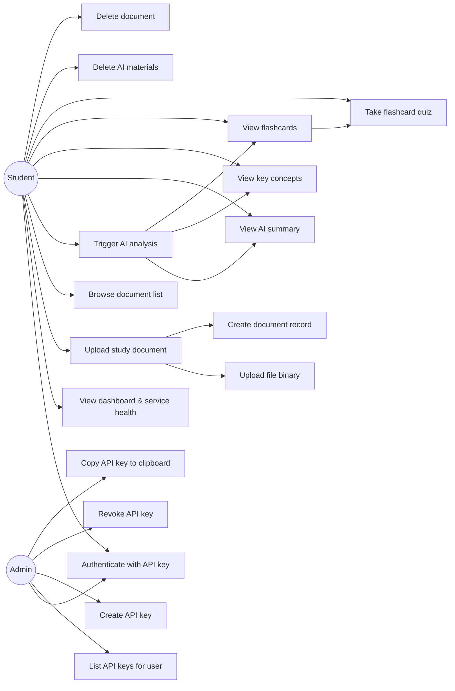
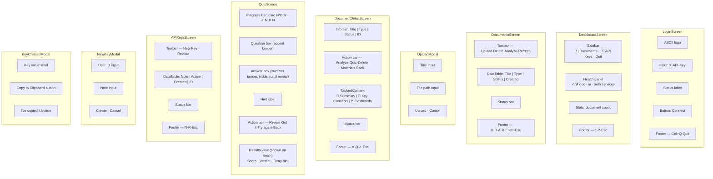
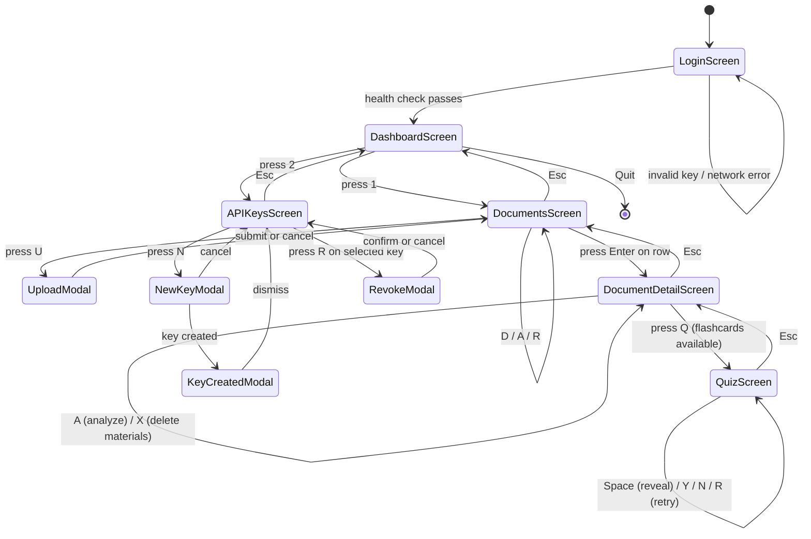

# Learnia TUI Client

A terminal UI client for the [Learnia](https://github.com/Saharfatemi22/Learnia) study platform,
built with [Textual](https://github.com/Textualize/textual).

Upload study documents, trigger AI analysis, browse AI-generated summaries, key concepts, and
flashcards, and manage API keys — all without leaving the terminal.

---

## Prerequisites

- Python **3.12** or newer
- The three Learnia backend services running (locally or on Rahti):
  - `document-service` (Spring Boot)
  - `ai-service` (FastAPI)
  - `auth-service` (Spring Boot)

---

## Installation

```bash
# 1 — clone / navigate to the project
cd client-tui

# 2 — create and activate a virtual environment
python3.12 -m venv .venv
source .venv/bin/activate          # macOS / Linux
# .venv\Scripts\activate           # Windows

# 3 — install dependencies
pip install -r requirements.txt
```

---

## Configuration

Service URLs default to the **public Rahti deployment**. Override them with environment
variables when running against a local stack:

| Variable | Default | Purpose |
|---|---|---|
| `LEARNIA_DOC_URL` | `https://document-service-learnia.2.rahtiapp.fi` | Document service base URL |
| `LEARNIA_AI_URL` | `https://ai-service-learnia.2.rahtiapp.fi` | AI service base URL |
| `LEARNIA_AUTH_URL` | `https://auth-service-learnia.2.rahtiapp.fi` | Auth service base URL |

```bash
# Example — run against a local Docker Compose stack
export LEARNIA_DOC_URL=http://localhost:8080
export LEARNIA_AI_URL=http://localhost:8003
export LEARNIA_AUTH_URL=http://localhost:8081
```

---

## Running the client

```bash
# With the virtual environment active:
python app.py

# Or without activating:
.venv/bin/python app.py
```

The **Login screen** appears first. Enter your `X-API-Key` (e.g. `dev-api-key-1-…`) and
press **Enter** or the **Connect** button.  The client validates the key by performing a
health check against the document service and navigates to the Dashboard on success.

---

## Features

### Dashboard
- Live health indicator for all three backend services (✓ green / ✗ red)
- Total document count fetched on load
- Sidebar navigation to Documents and API Keys screens

### Documents
| Key | Action |
|---|---|
| `U` | Upload a new document (opens modal — enter title + local file path) |
| `D` | Delete the selected document (confirmation dialog) |
| `A` | Trigger AI analysis for the selected document |
| `R` | Refresh the document list |
| `Enter` | Open document detail screen |
| `Esc` | Return to Dashboard |

### Document Detail
- Info bar showing title, file type, processing status, and shortened ID
- Three content tabs: **Summary**, **Key Concepts**, **Flashcards**

| Key | Action |
|---|---|
| `A` | Run OpenAI analysis (creates / refreshes all three tabs) |
| `Q` | Launch **Quiz Mode** for the current document's flashcards |
| `X` | Delete all AI materials for this document |
| `Esc` | Return to Documents |

### Quiz Mode *(extra feature)*
Turns AI-generated flashcards into an interactive self-assessment session:
1. The question is shown — press **Space** (or the Reveal button) to see the answer.
2. Mark yourself: **Y** = I knew it · **N** = I need more practice.
3. After all cards, a score summary is shown (percentage + emoji verdict).
4. Press **R** to retry the full deck or **Esc** to go back.

### API Keys
| Key | Action |
|---|---|
| `N` | Create a new API key (opens modal — enter User ID + note) |
| `R` | Revoke the selected key (confirmation dialog) |
| `Esc` | Return to Dashboard |

When a key is created, the plaintext value is shown **once** in a modal. A
**Copy to Clipboard** button copies it via the platform clipboard tool (`pbcopy` on
macOS, `xclip` on Linux, `clip` on Windows).

### Error handling
All API errors display the HTTP status code alongside the error message in the status
bar (e.g. `Error (HTTP 404): No materials found`) so failures are immediately actionable.
Destructive actions (delete document, revoke key) are always guarded by a confirmation
dialog.

---

## Keyboard Reference

| Key | Context | Action |
|---|---|---|
| `Ctrl+Q` | Anywhere | Quit the application |
| `1` | Dashboard | Open Documents |
| `2` | Dashboard | Open API Keys |
| `U` | Documents | Upload document |
| `D` | Documents | Delete selected document |
| `A` | Documents / Detail | Trigger AI analysis |
| `R` | Documents | Refresh list |
| `Enter` | Documents | Open document detail |
| `Q` | Document Detail | Launch flashcard quiz |
| `X` | Document Detail | Delete AI materials |
| `N` | API Keys | Create new key |
| `R` | API Keys | Revoke selected key |
| `Space` | Quiz | Reveal answer |
| `Y` | Quiz | Mark as correct |
| `N` | Quiz | Mark as wrong |
| `R` | Quiz (results) | Retry quiz |
| `Esc` | Any screen | Go back |

---

## Linting

[Ruff](https://github.com/astral-sh/ruff) is used for linting and import sorting
(configured in `pyproject.toml`):

```bash
# Check for issues
.venv/bin/ruff check .

# Auto-fix fixable issues
.venv/bin/ruff check . --fix
```

---

## Use Case Diagram



---

## Screen Layout Diagram



---

## Workflow / Transition Diagram



---

## Project Structure

```
client-tui/
├── app.py                    # Entry point — LearniaApp(App)
├── pyproject.toml            # Ruff linter configuration
├── requirements.txt          # Python dependencies
├── api/
│   ├── __init__.py
│   └── client.py             # LearniaClient — all HTTP calls (httpx)
└── screens/
    ├── __init__.py
    ├── login.py              # LoginScreen
    ├── dashboard.py          # DashboardScreen
    ├── documents.py          # DocumentsScreen + UploadModal + DeleteModal
    ├── document_detail.py    # DocumentDetailScreen
    ├── quiz.py               # QuizScreen (extra feature — flashcard self-assessment)
    └── api_keys.py           # APIKeysScreen + NewKeyModal + RevokeModal + KeyCreatedModal
```

---

## Credits & Libraries

| Library | Version | License | Purpose |
|---|---|---|---|
| [Textual](https://github.com/Textualize/textual) by Textualize | 0.47.1 | MIT | Terminal UI framework (widgets, screens, CSS styling, async event loop) |
| [httpx](https://github.com/encode/httpx) by encode | 0.25.1 | BSD-3-Clause | Synchronous HTTP client for all API calls |
| [Rich](https://github.com/Textualize/rich) by Textualize | 13.7.0 | MIT | Rich text rendering (used internally by Textual) |
| [Ruff](https://github.com/astral-sh/ruff) by Astral | 0.4.4 | MIT | Fast Python linter and import sorter |

The Textual [documentation](https://textual.textualize.io/) and
[examples](https://github.com/Textualize/textual/tree/main/examples) were used as
reference for widget composition patterns and CSS variables (`$accent`, `$success`, etc.).
