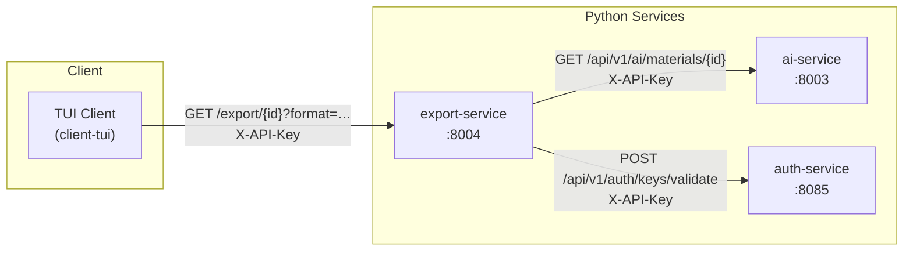

# Learnia Export Service

Auxiliary Python microservice that converts AI-generated study materials stored in the ai-service into portable, user-ready file formats.

## Justification

The core Learnia pipeline stores study materials (summary, key concepts, flashcards) as JSON inside the ai-service. Students need those materials in formats they can actually use for revision: a Markdown guide they can read in any editor, an Anki deck they can import for spaced-repetition practice, or a plain-text sheet for printing. The export-service acts as a format-translation layer so the ai-service stays format-agnostic and the TUI client can offer one-click export without duplicating conversion logic.

---

## Architecture



The export-service sits between the TUI client and the ai-service. It authenticates the caller via the auth-service, fetches the JSON materials from the ai-service, runs the appropriate formatter, and streams back the resulting file bytes with a `Content-Disposition` header so the client can save it directly to disk.

---

## API

| Method | Path | Description |
|--------|------|-------------|
| GET | `/health` | Liveness probe — returns `{"status":"healthy"}` |
| GET | `/` | Service info and list of supported formats |
| GET | `/export/{document_id}?format=…` | Download study materials in the requested format |

### Export formats

| `format` query value | MIME type | File extension | Content |
|---|---|---|---|
| `markdown` | `text/markdown` | `.md` | H1/H2 study guide with bold Q/A flashcards |
| `anki` | `text/plain` | `.txt` | Anki-importable TSV with `#separator:tab` headers |
| `text` | `text/plain` | `.txt` | Plain-text study sheet with ASCII section headers |

### Authentication

Every request to `/export/…` must include a valid `X-API-Key` header. The key is forwarded to the auth-service `POST /api/v1/auth/keys/validate` endpoint. A missing or invalid key returns HTTP 401.

---

## Installation

```bash
cd python-services/export-service
python -m venv .venv
source .venv/bin/activate
pip install -r requirements.txt
```

### Environment variables

| Variable | Default | Description |
|---|---|---|
| `AI_SERVICE_URL` | `http://localhost:8003` | Base URL of the ai-service |
| `AUTH_SERVICE_URL` | `http://localhost:8085` | Base URL of the auth-service |
| `SERVICE_PORT` | `8004` | Port the service listens on |
| `INTERNAL_API_KEY` | *(empty)* | Key used to call ai-service internally |

Copy `.env.example` or export variables manually:

```bash
export AI_SERVICE_URL=http://localhost:8003
export AUTH_SERVICE_URL=http://localhost:8085
export INTERNAL_API_KEY=your-internal-key
```

---

## Running locally

```bash
uvicorn src.main:app --reload --port 8004
```

Interactive API docs: `http://localhost:8004/docs`

---

## Running tests

```bash
pytest tests/ -v
```

All 29 tests should pass (18 formatter unit tests + 11 router integration tests).

---

## Linting

```bash
ruff check .
```

Zero violations expected with the `pyproject.toml` configuration included in this directory.

---

## Docker

```bash
# Build
docker build -t export-service .

# Run
docker run -p 8004:8004 \
  -e AI_SERVICE_URL=http://host.docker.internal:8003 \
  -e AUTH_SERVICE_URL=http://host.docker.internal:8085 \
  export-service
```

---

## Code structure

```
export-service/
├── src/
│   ├── main.py          # FastAPI app, CORS, OpenAPI customisation
│   ├── config.py        # Pydantic settings (env vars)
│   ├── auth.py          # require_api_key() FastAPI dependency
│   ├── routers/
│   │   └── export.py    # GET /export/{id} endpoint
│   └── formatters/
│       ├── markdown.py  # to_markdown() → .md study guide
│       ├── anki_csv.py  # to_anki_csv() → Anki TSV deck
│       └── plain_text.py# to_plain_text() → printable notes
└── tests/
    ├── test_formatters.py  # 18 unit tests (one per formatter method)
    └── test_routers.py     # 11 integration tests (FastAPI TestClient)
```
